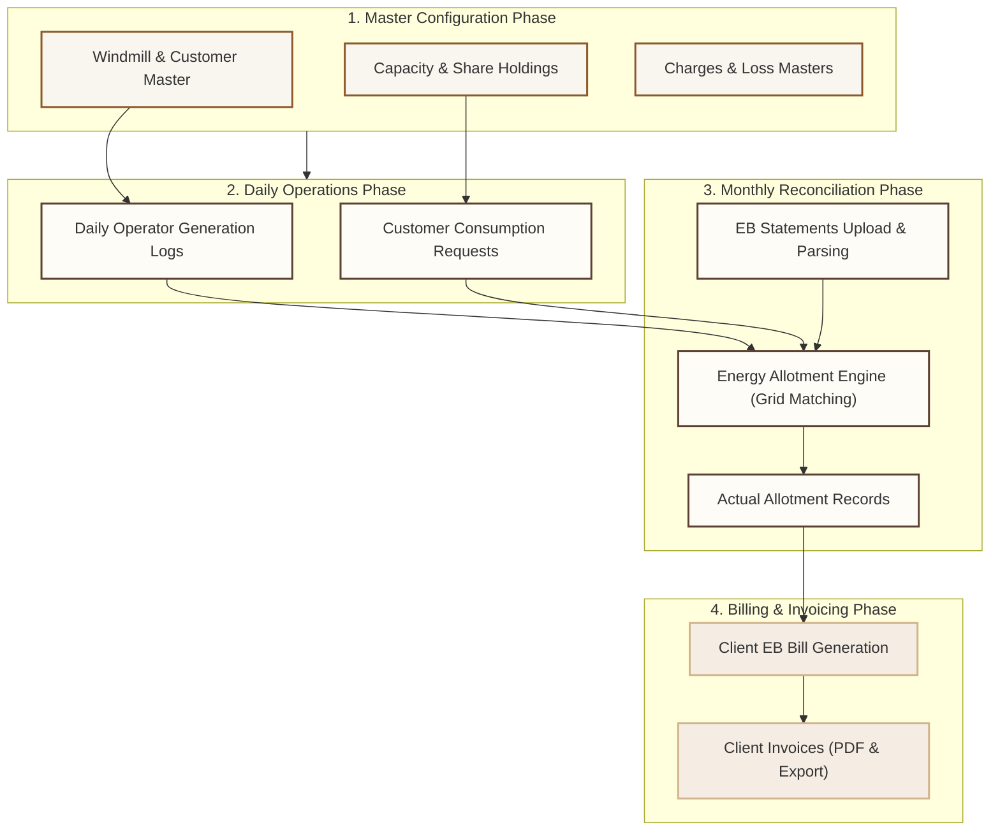

# EnergyMatrix: Windmill Management Overview & Navigation Manual

Welcome to the **EnergyMatrix Windmill Management** module user manual. This document provides an operational introduction, maps out our core business workflow, and catalogs the system’s menu and submenu navigation structure.

---

## 1. Introduction to Windmill Management

**EnergyMatrix** is an enterprise-grade utility resource planning (URP) platform tailored to manage the lifecycle of wind and solar energy generation, grid transmission, customer allotment, and commercial invoicing. 

The **Windmill Management** module serves as the functional spine of EnergyMatrix. It bridges the gap between daily raw generation assets and client-side financial operations. Through this module, operators and financial administrators can:
*   **Track Assets & Setup Masters:** Maintain high-fidelity records of windmills, capacities, company shareholdings, transmission loss configurations, and client profiles.
*   **Log Generation Data:** Input and post daily operator logs tracking energy production in Kilowatt-Hours (units).
*   **Process Utility (EB) Statements:** Upload and parse official Electricity Board (EB) monthly statements to reconcile raw operator data with utility-registered figures.
*   **Execute Energy Allotments:** Utilize a multi-dimensional allotment grid to distribute net generated energy to customer accounts, accounting for grid transmission losses and contract limits.
*   **Manage Financial Operations:** Generate customized monthly client invoices, execute EB charge comparisons, and audit energy wheeling expenses.

---

## 2. Core Functional Workflow

EnergyMatrix operates on a structured, four-phase monthly cycle. Below is a conceptual visual blueprint of how data is initialized, tracked, reconciled, and invoiced:

---

## 3. Sidebar Navigation: Menu & Submenu Matrix

The EnergyMatrix sidebar is dynamically populated and filtered based on role-based security permissions (`can_read` right configurations). Below is the comprehensive matrix of available modules:

| Sidebar Group | Submenu Item | Route / URL Path | Primary Icon | Operational Focus |
| :--- | :--- | :--- | :--- | :--- |
| **Master** | [Transmission Loss](#master---transmission-loss) | `/master/transmission-loss` | `Activity` | Grid wheeling loss coefficients (%) |
| | [EDC Circle](#master---edc-circle) | `/master/edc-circle` | `ClipboardList` | Regional Electricity Distribution Circles |
| | [Capacity](#master---capacity) | `/master/capacity` | `Zap` | Windmill MW capacity registries |
| | [Windmill](#master---windmill) | `/master/windmill` | `Wind` | Asset details, owner registry, and EDC mapping |
| | [Customers](#master---customers) | `/master/customers` | `Users` | Consumer profiles and service locations |
| | [Company Shares](#master---company-shares) | `/master/company-shares` | `PieChart` | Enterprise-wide asset stock distribution |
| | [Investors](#master---investors) | `/master/investors` | `Users` | Capacity financing stakeholders |
| | [Share Holdings](#master---share-holdings) | `/master/share-holdings` | `PieChart` | Client equity and windmill allocation ratios |
| | [Consumption Charges](#master---consumption-charges) | `/master/consumption-charges` | `Zap` | Custom grid, wheeling, and subsidiary tariffs |
| | [Email](#master---email) | `/master/email` | `Zap` | Automated notification configurations |
| **Windmill** | [Daily Generation](#windmill---daily-generation) | `/windmill` | `CloudSun` | Operators' daily generation logs (kWh) |
| | [EB Statement](#windmill---eb-statement) | `/eb-statement` | `FileText` | Electricity Board statement imports & audits |
| | [Cust Cons Req](#windmill---cust-cons-req) | `/consumption-request` | `ClipboardList` | Monthly energy requests from clients |
| | [Energy Allotment](#windmill---energy-allotment) | `/energy-allotment` | `Zap` | Multi-party energy allocation spreadsheet grid |
| | [Client EB Bill](#windmill---client-eb-bill) | `/windmill/eb-bill` | `CreditCard` | Electricity Board bills for commercial energy |
| | [Actual Allotment](#windmill---actual-allotment) | `/windmill/actuals` | `CreditCard` | Reconciled statement allocations |
| | [Client Invoice](#windmill---client-invoice) | `/windmill/client-invoice` | `ReceiptText` | Automated client billing and PDF invoice prints |
| **Solar** | [EB Statement-Solar](#solar---eb-statement-solar) | `/eb-statement-solar` | `CreditCard` | Monthly solar plant statement imports |
| **Logs** | [User Sessions](#logs---user-sessions) | `/admin/sessions` | `Users` | Active session tracking & security auditing |
| | [Error Logs](#logs---error-logs) | `/admin/error-logs` | `Layers` | Backend stack traces and exception audits |

---

## 4. In-Depth Submenu Guide

### Master Group
This section establishes the operational, geographical, and legal context for all energy generation calculations.

#### Master - Transmission Loss
*   **Description:** Configures grid transmission loss percentages. Wheeling power from high-voltage generation points to customer meters incurs standard power losses. These loss coefficients ensure that net generation units are mathematically reduced before allotment to avoid utility deficits.
*   **Key Operations:** Grid lists, loss factor editing, active/inactive statuses.
*   **Downstream Module Usage:**
    *   *Windmill Master*: Assigned to physical generator profiles.
    *   *Energy Allotment*: Loaded by the computational engine to apply transmission loss deductions.

#### Master - EDC Circle
*   **Description:** Manages **Electricity Distribution Circles (EDC)**. Each windmill and customer is geographically and legally linked to an EDC Circle (e.g., Udumalpet, Palladam). These circles govern regional utility tariffs and coordinate transmission rules.
*   **Key Operations:** Circle adding, circle indexing, region mappings.
*   **Downstream Module Usage:**
    *   *Windmill Master*: Links physical generators to region-specific utility networks.
    *   *Customer Master*: Maps registered service connections to their administrative utility circles.
    *   *EB Statement*: Groups statement reconciliations by regional boundaries.
    *   *Client EB Bill*: Audits distribution charges based on regional circles.

#### Master - Capacity
*   **Description:** Registers installation capacity records measured in Megawatts (MW). Used by the calculation engine to run feasibility reports and check compliance against baseline physical ratings.
*   **Key Operations:** Capacity definition and threshold controls.
*   **Downstream Module Usage:**
    *   *Windmill Master*: Restricts and governs windmill profile configuration fields.

#### Master - Windmill
*   **Description:** The centralized physical asset registry. Records key metadata such as windmill numbers, generator makes, physical locations, capacities, owner corporations, and corresponding grid connections.
*   **Key Operations:** Asset search, adding physical windmills, editing technical details, mapping to investors.
*   **Operational Sub-Tabs (Create & Edit Views):**
    *   *Windmill Details*: Core specifications (Type, Number, Capacity, EDC Circle, AE, Operator details) along with Annual Maintenance Contract (AMC) and Insurance timelines.
    *   *Upload Docs*: Direct file uploads for official windmill records (e.g., Commission Certificates, Name Transfer Documents, PPA Contracts, Wheeling Agreements, and Insurance Policies).
    *   *Slot Timings*: Configures active operational shift periods and tracking timing rules.
*   **Downstream Module Usage:**
    *   *Daily Generation*: Identifies the generating asset when operators submit daily logs.
    *   *EB Statement*: Matches official utility statements to corresponding physical units.
    *   *Share Holdings*: Maps investor and client ownership splits to the physical generator.
    *   *Energy Allotment*: Serves as the key generator index for energy allocation matrices.
    *   *Charge Allocation*: Defines the mapping parent for allocating windmill grid consumption charges.

#### Master - Customers
*   **Description:** Manages clients and corporate off-takers who have power purchase agreements (PPAs) with windmill owners. Defines tax registrations, utility service numbers, and billing addresses.
*   **Key Operations:** Client profile creation, contact management, active status indicators.
*   **Operational Sub-Tabs (Create & Edit Views):**
    *   *Customer*: Primary contact records (Name, Address, PAN, GST number, Active state).
    *   *Service Number*: Configures Electricity Board (EB) Service Numbers, EDC Circle assignments, KVA capacities, and status logs on a per-customer basis.
    *   *Contact Details*: Registers multiple authorized administrative contacts for automated notifications.
    *   *Upload Docs*: Uploads customer contract assets, including PPA files, Share Transfers, Share Certificates, Pledge documents, and Share Holdings.
    *   *Agreed Units*: A dynamic matrix mapping contractual unit quotas (across C1, C2, C4, C5 slots) and contractual pricing rates per unit.
*   **Downstream Module Usage:**
    *   *Share Holdings*: Connects customer accounts to generator equity portfolios.
    *   *Cust Cons Req*: Matches consumer demands against client accounts.
    *   *Energy Allotment*: Identifies the destination accounts for allotted energy balances.
    *   *Charge Allocation*: Maps monthly grid consumption fees to the client's service connection.
    *   *Client Invoice*: Imports billing parameters (Name, GST, PAN) for automated PDF invoice generation.

#### Master - Company Shares
*   **Description:** Configures the overarching shareholding matrix of the energy matrix group, regulating general asset share pools.
*   **Key Operations:** Share structure parameters, tracking equity bases.
*   **Downstream Module Usage:**
    *   *Share Holdings*: Validates cumulative shares to ensure allocations stay within holding rules.

#### Master - Investors
*   **Description:** Registers investor entities, tracking their funding allocations, PPA agreements, and legal entities.
*   **Key Operations:** Investor listing, stakeholder profiling, contact parameters.
*   **Downstream Module Usage:**
    *   *Windmill Master*: Matches asset funders to active windmills.
    *   *Share Holdings*: Profiles the ultimate capacity share beneficiaries.

#### Master - Share Holdings
*   **Description:** Establishes the link between investors, client companies, and windmills. Dictates what percentage of generated units from a specific windmill belongs to which customer.
*   **Key Operations:** Mapping shares, editing holding percentages (%), validation of total holdings (must sum to <= 100%).
*   **Downstream Module Usage:**
    *   *Energy Allotment*: The calculation engine relies directly on these equity percentages to distribute net generated units monthly.

#### Master - Consumption Charges
*   **Description:** Stores financial variables and operational tariffs (e.g., cross-subsidy charges, wheeling charges, state electricity tax). These values dynamically feed client billing equations.
*   **Key Operations:** Tariff rate inputs, historical charge audits, tax coefficient adjustments.
*   **Downstream Module Usage:**
    *   *EB Statement*: Feeds baseline rates to the EB Charge Comparison model to highlight billing variances.
    *   *Charge Allocation*: Populates selectable charge types for client billing mappings.
    *   *Client Invoice*: Feeds direct billing multipliers to compute monthly energy tariffs.

#### Master - Email
*   **Description:** Governs configurations for automatic outbound emails, helping the system email monthly actual statements and invoices straight to customers.
*   **Key Operations:** SMTP profiles, recipient distribution lists, document delivery status trackers.
*   **Downstream Module Usage:**
    *   *Client Invoice*: Pulls distribution lists to automate direct delivery of finalized PDF invoices and actual allotments.

---

---

### Windmill Operations Group
This group handles the core transactional, analytical, and operational workflows of the wind energy business on a day-to-day and month-to-month basis.

#### Windmill - Daily Generation
> [!NOTE]
> Operators submit logs daily. However, to prevent billing errors, once a generation log is marked as **Posted (P)**, it becomes locked and cannot be edited by the operator. Only **Saved (S)** logs can be corrected.
*   **Description:** Captures energy generation units (kWh) reported directly by operators at the physical windmill sites.
*   **Interface Controls:**
    *   *Search Bar:* Filters records by Windmill Asset, Year, Month, or custom Date Ranges.
    *   *Global Search:* Fast keyword match on table rows.
    *   *Actions:* Edit/Delete for draft entries; PDF export.
    *   *Import/Export:* `Export Excel` extracts reports instantly to CSV.

#### Windmill - EB Statement
*   **Description:** Dedicated to monthly utility statement reconciliation. Administrators upload official Electricity Board files (Excel/PDF) into the platform.
*   **Reconciliation & Analytics:** Includes the `EB Charge Comparison` module, which highlights billing anomalies by comparing actual EB bills against master consumption charge parameters.

> [!WARNING]
> **Strict Upload Validation & Duplicate Checks:**
> *   **Metadata Match Enforcements**: When uploading an EB Statement PDF/Excel file, the system automatically validates its contents against the currently selected **Month**, **Year**, and **Windmill Number**. If a mismatch is identified, the file is rejected and an immediate notification is displayed.
> *   **Duplicate File Prevention**: Operators are strictly prohibited from uploading more than one (1) statement PDF/Excel file for the same Windmill, Month, and Year. Duplicate uploads are blocked by default.

#### Windmill - Cust Cons Req
*   **Description:** Tracks client-side requests. Before the energy allotment is processed, clients submit their monthly energy consumption requests based on their operational demands.
*   **Key Operations:** Record demands, compare allocation capacities, and check utility thresholds.

#### Windmill - Energy Allotment & Allocation Workspace

The **Energy Allotment & Allocation** workspace is the computational heart of the EnergyMatrix platform. It acts as the transaction router where raw generated energy is legally distributed to off-takers, grid wheeling charges are assigned to specific customer accounts, and official utility records are frozen.

The workspace is structured into three specialized operational interfaces: **Energy Allotment List**, **Charge Allocation**, and **Allotment Order Upload**.

---

### 1. Energy Allotment List Tab
The Allotment List is a high-density, multi-dimensional spreadsheet grid used to allocate monthly generated energy units to customer service connections across four primary daily operational slots: **C1** (Morning Peak), **C2** (Daytime), **C4** (Evening Peak), and **C5** (Nighttime).

#### 🔌 Sourced Data Inputs (Where do the values come from?)
The allotment grid synthesizes data from multiple master and transaction layers:
*   **Customer & Service Numbers**: Loaded directly from the **Customer Master** database (under the *Customer* and *Service Number* tabs), establishing the active grid accounts.
*   **Windmill Registry**: Windmill codes and physical models are pulled from the **Windmill Master**.
*   **Original Pool Balances**: The starting available generation units for each windmill are extracted from the **EB Statement** page after uploading and parsing the utility's monthly statement.
*   **Consumption Requests**: Target demand parameters and maximum legal limits are loaded from the **Cust Cons Req** page, ensuring allocations do not exceed client requests.
*   **Agreed Units**: Contractual baseline allocations are pulled from the customer's **Agreed Units** tab in the Customer Master.
*   **Adjusted Totals / Client Actuals**: Real-time adjusted generation figures are mapped from the **Actual Allotment** audit trail.

#### ⚙️ How the Operational Flow Works
1.  **Select Billing Period**: The operator selects the active **Year** and **Month** from the header controls.
2.  **Generate Skeleton Grid**: The page renders a list of all registered customer service connections alongside drop-down lists of active windmills.
3.  **Assign Assets & Units**: For each customer service number, the operator assigns the generating windmill and enters the allocated energy units inside the slot columns (**C1, C2, C4, C5**).
4.  **Real-Time Deduction**: As the operator types, the frontend calculation engine dynamically deducts the allocated units from that windmill's available generation pool and updates the remaining balances shown in the grid headers.
5.  **Reconcile & Freeze**: When the grid balances out, the operator clicks **Save**. The system records the allocations to the database and syncs the remaining balances downstream for invoicing.

#### 🔄 Understanding the Mutual & Directional Borrowing Rules
To prevent energy waste and maximize slot utilization, the EnergyAllotment engine implements a robust **mutual and directional borrowing logic** between generation slots during unit allocation:
*   **C1 ↔ C2 Mutual Borrowing**: Slot C1 (morning peak) and Slot C2 (daytime) can mutually share energy. If Slot C1 runs out of generated units, it can automatically borrow available energy units from the Slot C2 pool, and vice-versa.
*   **C4 → C5 Directional Borrowing**: Slot C4 (evening peak) is legally permitted to borrow surplus energy units from Slot C5 (nighttime).
*   **C5 🚫 C4 Borrowing Restriction**: To comply with utility regulations and prevent peak grid arbitrage, Slot C5 **cannot** borrow energy from the Slot C4 evening peak. C5 is strictly restricted to its own nighttime generation and any leftover units must remain banked.

#### 🔋 What are "P:" and "B:"? (Power Plant vs. Banking Units)
Each generation slot in the grid header and calculation cell contains two distinct components:
*   **P (Power Plant Units)**: Represents the net physical active energy generated directly by the windmill's alternator during the current billing month's operational slot. These units are consumed first during allotment because they must be utilized in the active utility cycle.
*   **B (Banking Units)**: Represents energy generated in previous months that was not fully utilized by off-takers. This surplus energy is legally "banked" with the Electricity Board (EB) grid utility and carried forward as credit. The system draws from banked units only after the current month's active Power Plant generation (`P`) for that slot has been completely exhausted.

#### 📝 Cell Allotment Priority Algorithm
When an operator enters an allotment value in a slot cell, the calculation engine runs the following priority sequence:
1.  Draws from the windmill's **Own Slot Power Plant (P) pool** first.
2.  If a shortfall remains, draws from the windmill's **Own Slot Banking (B) pool**.
3.  If a shortfall still remains and an authorized partner slot is available (e.g. C2 for C1, or C5 for C4):
    *   Draws from the **Partner Slot Power Plant (P) pool**.
    *   Draws from the **Partner Slot Banking (B) pool**.
4.  Updates the active available balances dynamically.

---

### 2. Charge Allocation Tab
The **Charge Allocation** tab is a specialized grid used to assign and audit utility grid operational charges for each windmill's assigned customer service connection for the selected billing month.

#### 💡 Sourced Data Inputs (Where do the values come from?)
*   **Windmill Masters**: Pulls all active physical windmills.
*   **Customer Master & SE Maps**: Populates the Customer and Service Number dropdowns to link windmill outputs to specific client billing accounts.
*   **Applicable Charges Summary**: Automatically fetches actual parsed charge rates (MRC, OMC, TRC, etc.) directly from the uploaded **EB Statements** for that billing period, pre-filling the table rows to eliminate manual entry errors.
*   **Consumption Charges Master**: Feeds standard baseline charge codes (e.g., C001, C002, etc.) and fallback tariff rates.

#### ⚙️ Grid Layout & Charges Managed
The grid coordinates the following monthly utility charges on a per-windmill basis:
*   **MRC (C001 - Monthly Record Charges)**: General recording meter tariff fees.
*   **OMC (C002 - Operation & Maintenance Charges)**: Generator physical maintenance splits.
*   **TRC (C003 - Transmission & Wheeling Charges)**: Grid loss compensation fees.
*   **OC (C004 - Operating Cost / Other Charges)**: Administrative or custom operational additions.
*   **KP (C005 - K.P. Charges)**: K.P. specific utility tariffs.
*   **EC (C006 - State Electricity Tax / Charges)**: Government electricity grid tax coefficients.
*   **SHC (C007 - Share Holding Charges)**: Custodian or share ledger service charges.
*   **Other (C008 - Miscellaneous Charges)**: Auxiliary grid charges.
*   **DC (C010 - Demand Charges)**: Maximum demand grid service line fees.

#### 🔒 Strict Validation Rules (Preventing Invoicing Errors)
To maintain structural ledger integrity and ensure seamless PDF commercial invoice compilation, the Charge Allocation engine enforces a **strict one-to-one mapping constraint**:
*   **Single Customer Assignment**: A physical windmill generator (identified by its unique `windmill_id`) can be assigned to **exactly one** customer's service connection (`service_id`) for any given month and year.
*   **In-Place Overwrite Logic**: If the operator updates a windmill allocation to a different customer or service ID, the system **automatically overwrites the existing mapping row** in the database rather than creating a new row. This prevents duplicate charges and ensures that the monthly invoice contains exactly one correct grid charge summary for that windmill.

#### ☀️ Solar Charge Allocation Sub-Grid
Positioned directly beneath the physical windmill grid, this section handles charge allocations for solar assets:
*   **Solar Windmills**: Loaded via the solar registry (`/eb-solar/windmills`).
*   **Solar Allotment Logic**: Since solar energy allotment is parsed separately from wind, this sub-grid allows operators to record, audit, and save solar wheeling charges and grid tax margins directly on a per-customer service number basis.

#### Windmill - Client EB Bill
*   **Description:** Registers the official utility bills issued by the state electricity board for customer service connections, documenting grid utilization and network costs.
*   **Key Operations:** Uploading bills, tracking fixed and demand charges, comparing billing periods.

> [!WARNING]
> **Strict Upload Validation & Duplicate Checks:**
> *   **Metadata Match Enforcements**: When uploading a Client EB Bill PDF, the system strictly validates the file contents against the selected **Month**, **Year**, and **Customer Service Connection Number**. Any mismatch blocks the upload and triggers an error notification.
> *   **Duplicate File Prevention**: Enforces a strict one-file-per-period rule. You cannot upload a second (duplicate) EB Bill PDF for the same Customer Service Connection, Month, and Year.

#### Windmill - Actual Allotment (Adjusted Report)
*   **Description:** Generates actual allotment audits that match physical windmill generations to the customer meters, establishing official audit trails for billing.
*   **Key Operations:** Reconciling operator records with EB logs, compiling net-adjusted allotments.

> [!WARNING]
> **Strict Upload Validation & Duplicate Checks:**
> *   **Metadata Match Enforcements**: The Adjusted Report PDF upload strictly verifies that the document contents align with the selected **Month**, **Year**, and **Windmill/Customer** profile. File mismatches will be immediately flagged, blocking the upload.
> *   **Duplicate File Prevention**: The system restricts uploads to exactly one (1) active Adjusted Report PDF for the same windmill/customer connection, Month, and Year. Attempting to upload a duplicate second PDF is disabled.

#### Windmill - Client Invoice & Billing Engine

> [!IMPORTANT]
> The **Client Invoice** workspace is the ultimate financial reconciliation gate of EnergyMatrix. It synthesizes contractual pricing terms, generational offsets, grid wheeled charges, and tax policies into a standardized, audit-ready commercial Bill of Supply. It supports multi-source aggregation, in-place administrative adjustments, and strict legal tax exemption workflows.

*   **Description:** An enterprise invoicing portal supporting automated client invoice generation, real-time value and charge auditing, interactive PDF rendering, and direct printing tools.

---

### 1. Sourced Data Inputs & Formula Routing
When generating a monthly invoice for a customer's specific service connection, the billing engine merges parameters from multiple layers of the system:
*   **Customer & Service Demographics**: Fetched from the **Customer Master** page (Customer and Service Number sub-tabs). Pre-fills Name, Address, City, PAN, and GSTIN.
*   **Generated Units (Units)**: Summed in real time from the **Actual Allotment** (or client actuals) table for the given period.
*   **Rate per Unit (Rate)**: Loaded from the **Agreed Units** tab (PPA Invoice Constant field) of the Customer Master. Falls back to a standard rate of ₹ 6.80 if unconfigured.
*   **Energy Amount**: Calculated as:
    $$\text{Energy Amount} = \text{Generated Units} \times \text{Rate per Unit}$$

---

### 2. Multi-Source Charge Aggregation (Windmill & Solar)
EnergyMatrix supports dual-generation offsetting. The billing engine compiles utility charges from both the Windmill Charge Allocation and Solar Charge Allocation databases for the matching period, combining them into individual deduction items:
*   **Meter Charges (Meter)**: Sum of Windmill + Solar meter charges.
*   **O&M Charges**: Sum of Windmill + Solar Operation & Maintenance charges.
*   **Transmission Charges (Transmsn Chrgs)**: Sum of Windmill + Solar grid transmission charges.
*   **System Operation Charges (Sys Opr Chrgs)**: Sum of Windmill + Solar system operational fees.
*   **RkvAh Charges**: Reactive power penalties drawn from the statement summary.
*   **Import Charges (Import Chrgs)**: Auxiliary grid import fees.
*   **Scheduling Charges**: Regional grid scheduling fees.
*   **DSM Charges**: Deviation Settlement Mechanism penalty fees.
*   **Wheeling Charges**: Transmission wheeling fees.
*   **Other Charges**: Miscellaneous operational additions.
*   **Self Generation Tax (Self gen tax)**: Calculated grid tax on physical windmill generation.

> [!TIP]
> The invoice preview includes interactive **Tooltips**. Hovering over any charge line displays the exact split (e.g. `1,200.00 (Windmill) + 300.00 (Solar) = 1,500.00`), providing total transparency during audits.

---

### 3. Self Generation Tax Visibility & Special Exemption Rules
The **Self Generation Tax** represents a state-regulated electricity tax levied on generated wind units. It is computed as:
$$\text{Self Gen Tax} = \text{Windmill Actual Units} \times \text{Electricity Tax Rate}$$

#### 🔒 Special L&T / Larsen & Toubro Exemption Rules
To handle custom corporate tax concessions, the invoice compiler implements a strict, automated name-matching verification rule:
*   **Exemption Rule**: If the customer name contains **`L&T`**, **`Larsen`**, or **`Larson`** (case-insensitive), the system automatically overrides the calculated tax and sets it to **₹ 0.00** (Tax Exempted).
*   **Audit Tooltip**: The corresponding line is marked as exempted, and the details register is appended with the tooltip calculation `"Exempted for L&T"`.
*   **Tax Amount (in words)**: Renders as **`NIL`** in the invoice footer, with the remarks section automatically noting `"Tax Exempted"`.

---

### 4. Administrative Auditing & Editing Capabilities
Invoices are generated in a draft state and can be fully edited by authorized administrators prior to printing:
*   **Dispatch & Delivery Metadata**: Users can manually input and edit logistics data:
    *   *Delivery Note & Date*
    *   *Mode/Terms of Payment*
    *   *Reference No. & Date / Other References*
    *   *Buyer's Order No. & Date*
    *   *Dispatch Doc No. & Dispatched Through*
    *   *Destination & Terms of Delivery*
*   **Financial Corrections**: Administrators can edit **Generated Units**, **Rate per Unit**, and **individual charge amounts** directly within the edit grid.
*   **Real-Time Balance Updates**: As values are modified, the page dynamically recalculates and updates the:
    *   *Net Energy Value*
    *   *Total Deductions*
    *   *Final Amount (Energy Value - Total Deductions)*
*   **Print and Export**: Clicking **Save** updates the database and redirects the operator to the professional, high-fidelity A4 A-grade print layout, equipped with cross-browser printing controls (`window.print()`).

---

### Solar Operations Group
This group separates solar park transactions from wind transactions, ensuring clean isolation of accounts and distinct grid charge models.

#### Solar - EB Statement-Solar
*   **Description:** Provides dedicated monthly EB statement upload, comparison, and reporting workflows specifically designed for solar assets.
*   **Reconciliation & Analytics:** Integrates `Solar Charge Comparison` models to capture the distinct billing rates and peak/off-peak solar generation cycles.

> [!WARNING]
> **Strict Upload Validation & Duplicate Checks:**
> *   **Metadata Match Enforcements**: When uploading a Solar EB Statement PDF, the system automatically validates its contents against the currently selected **Month**, **Year**, and **Solar Windmill ID**. Mismatched files cannot be uploaded and will trigger an error notice.
> *   **Duplicate File Prevention**: Enforces a strict one-statement-per-period rule per Solar windmill. Operators cannot upload multiple (duplicate) statements for the same month, year, and solar asset.

---

### Logs & Administration Group
Contains critical back-end monitoring dashboards for platform admins, security officers, and developers.

#### Logs - User Sessions
*   **Description:** Real-time security portal. Monitors active users, logs terminal IP addresses, tracks browser user-agent details, and details session duration to protect system integrity.
*   **Key Operations:** Session auditing, security tracing, administrative force-logout.

#### Logs - Error Logs
*   **Description:** Diagnoses system health. Automatically logs all backend server exceptions, failed database transactions, and API timeout errors.
*   **Key Operations:** Search logs by date range or code module, review diagnostic stack traces, export reports to debug system processes.

---

> [!TIP]
> For questions about custom report exports or database reconciliation scripts, please contact the administrator or consult the *System Operations Manual*.
